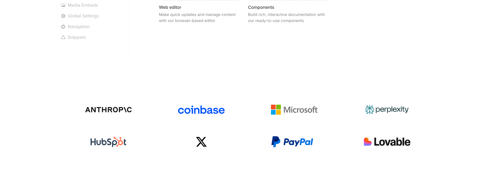

# Mintlify Clone

A simple static clone of the Mintlify landing page built using **pure HTML and CSS**.  
This project focuses on recreating the layout and visual design of Mintlify for frontend practice.

---

## Project Overview

This repository contains a basic frontend clone of the Mintlify website created with vanilla HTML and CSS.  
The goal of this project was to improve layout structuring, CSS styling, and UI replication skills.

---

## Tech Stack

- HTML5
- CSS3

---

## Live Demo

GitHub Pages link:
https://SyedHammad-cs.github.io/mintlify-clone/

---

## Features

- Static Mintlify UI clone
- Clean layout structure
- Custom CSS styling
- Beginner-friendly project

---

## Screenshots

---

